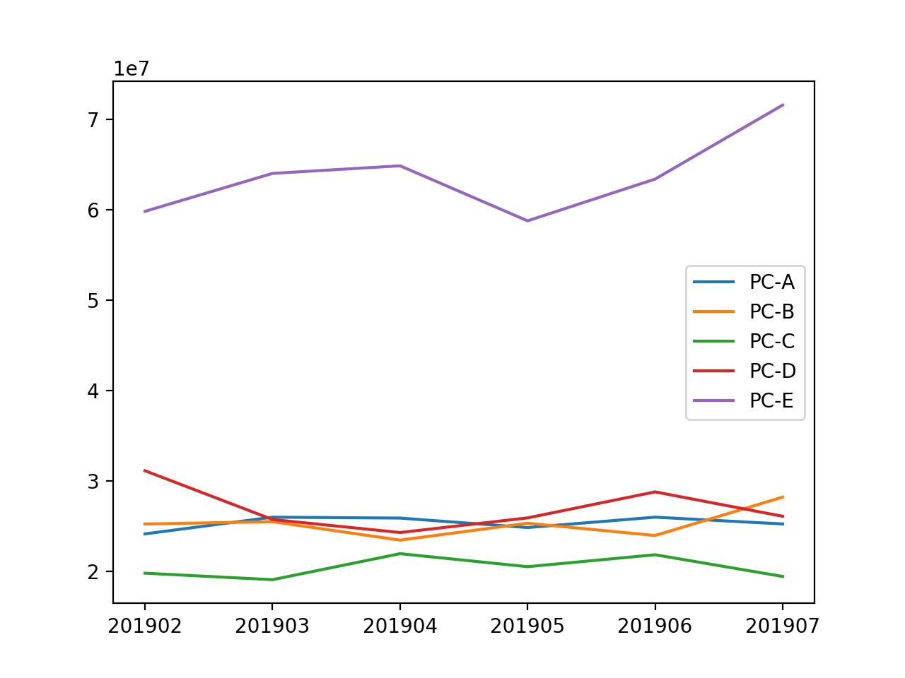

# Web からの注文数を分析する１０本ノック

## データの読みこみ


'csv/customer_master.csv' を 'customer_master' として読み込め。

```python
import pandas as pd

customer_master = pd.read_csv('csv/customer_master.csv')
```

'csv/item_master.csv' を item_master として読み込め。

```python
item_master = pd.read_csv('csv/item_master.csv')
```

'csv/transaction_1.csv' を transaction_1 として読み込め。
```python
transaction_1 = pd.read_csv('csv/transaction_1.csv')  
```

'csv/transaction_detail_1.csv' を transaction_detail_1 として読み込め。
```python
transaction_detail_1 = pd.read_csv('csv/transaction_detail_1.csv')
```


## データの連結
'csv/transaction_2.csv' を読み込み、'transaction_1' に連結し、'transaction' を作成せよ。

```python
transaction = pd.concat([transaction_1, pd.read_csv('csv/transaction_2.csv')], ignore_index=True) 
```

'csv/transaction_detail_2.csv' を読み込み、'transaction_detail_1' に連結し、'transaction' を作成せよ。


```python
transaction_detail = pd.concat(
    [transaction_detail_1, pd.read_csv('csv/transaction_detail_2.csv')],
    ignore_index=True) 
```


## データのマージ
transaction_detail に transaction の 'payment_date' と 'customer_id' を transaction_id をキーにしてマージし、'join_data' を作成せよ。

```python
join_data = pd.merge(   transaction_detail,  
                        transaction[['transaction_id', 'payment_date', 'customer_id']], 
                        on='transaction_id', how='left')  
```

join_data に 'item_id' をキーにして item_master をマージせよ。

```python
join_data = pd.merge(join_data, item_master, on='item_id', how='left')
```

## 列の追加

join_dataに 'quantity' と 'item_price' を掛けて 'price' 列を作成せよ。

```python
join_data['price'] = join_data['quantity'] * join_data['item_price']
```

## 計算
join_data の 'price' の合計を算出せよ。

```python
join_data['price'].sum()
```
```
971135000
```

join_data の 'price' の各種統計を算出せよ。
```python
join_data['price'].describe()
```
```
count      7144.000000
mean     135937.150056
std       68511.453297
min       50000.000000
25%       85000.000000
50%      120000.000000
75%      210000.000000
max      420000.000000
Name: price, dtype: float64
```

## 欠損値
join_data の欠損値の有無を確認せよ。
```python
join_data.isnull().sum()
```
```
detail_id         0
transaction_id    0
item_id           0
quantity          0
payment_date      0
customer_id       0
item_name         0
item_price        0
price             0
dtype: int64
```


## グループ化
join_data の 月ごとの 'price' の合計値を算出せよ。

```python
join_data['payment_month'] = pd.to_datetime(join_data['payment_date']).dt.strftime('%Y%m')  

join_data.groupby(by='payment_month')['price'].sum()
```
```
payment_month
201902    160185000
201903    160370000
201904    160510000
201905    155420000
201906    164030000
201907    170620000
Name: price, dtype: int64
```


join_data の 月とアイテムごとの 'price' と 'quantity' の合計値を算出せよ。

```python
join_data.groupby(by=['payment_month','item_name'])[['price','quantity']].sum() 
```

```
                   price  quantity
payment_month                     
201902         160185000      1403
201903         160370000      1427
201904         160510000      1421
201905         155420000      1390
201906         164030000      1446
201907         170620000      1485
```

## グラフ表示
'join_data' の 'price' の 'item_name'　毎の月ごとの合計値を折れ線グラフで表示せよ。

```python
graph_data = pd.pivot_table(join_data, index='item_name', columns='payment_month', values='price', aggfunc='sum')

import matplotlib.pyplot as plt

for idx in graph_data.index: 
    plt.plot(graph_data.columns.values, graph_data.loc[idx].values, label=idx) 
    
plt.legend()
plt.pause(0.5)
```


