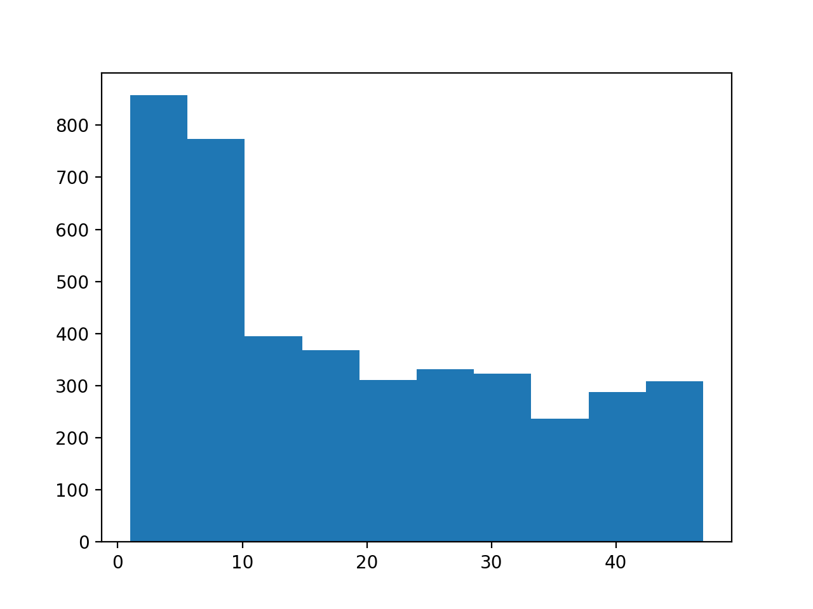

# 顧客の全体像を把握する１０本ノック

## データの読み込み

### uselog に 'csv/use_log.csv' を読み込め。

```python
import pandas as pd

uselog = pd.read_csv('csv/use_log.csv')
```

### customer に 'csv/customer_master_w_class.csv' を読み込め。

```python
customer = pd.read_csv('csv/customer_master_w_class.csv')
```

### class_master に 'csv/class_master.csv' を読み込め。

```python
class_master = pd.read_csv('csv/class_master.csv')
```

### campaign に 'csv/campaign_master.csv' を読み込め。
```python
campaign_master = pd.read_csv('csv/campaign_master.csv')
```

## データ整形

### customer と class_master を 'class' をキーにマージし、customer_join を作成せよ。

```python
customer_join = pd.merge(customer, class_master, on='class', how='left')
```

### customer_join と campaign_master を 'campaign_id' をキーにマージせよ。

```python
customer_join = pd.merge( customer_join,
                          campaign_master,
                          on='campaign_id', how='left')
```

### customer_join の 欠損値のある 列を確認せよ。

```python
customer_join.isnull().any()
```

```
customer_id      False
name             False
class            False
gender           False
start_date       False
end_date          True
campaign_id      False
is_deleted       False
class_name       False
price            False
campaign_name    False
dtype: bool
```

### 'end_date' が欠損している数を数えろ。

```python
customer_join['end_date'].isnull().sum()
```
```
2842
```

## 基礎集計

customer_join を 'class_name' 毎に集計して、カスタマー数を計算せよ。

```python
customer_join.groupby(by='class_name')['customer_id'].count()
```
```
class_name
オールタイム    2045
デイタイム     1019
ナイト       1128
Name: customer_id, dtype: int64
```

'campaign_name' 毎に集計して、カスタマー数を計算せよ。
```python
customer_join.groupby(by='campaign_name')['customer_id'].count()
```

```
campaign_name
入会費半額     650
入会費無料     492
通常       3050
Name: customer_id, dtype: int64
```

'gender' 毎に集計して、カスタマー数を計算せよ。

```python
customer_join.groupby(by='gender')['customer_id'].count()
```
```
gender
F    1983
M    2209
Name: customer_id, dtype: int64
```

'id_deleted' 毎に集計して、カスタマー数を計算せよ。

```python
customer_join.groupby(by='is_deleted')['customer_id'].count()
```

```
is_deleted
0    2842
1    1350
Name: customer_id, dtype: int64
```

2018年4月1日以降に入会した顧客の data frame を抽出せよ。

```python
customer_join['start_date'] = pd.to_datetime(customer_join['start_date'])

customer_start = customer_join[customer_join['start_date'] >= pd.to_datetime('2018/04/01')]
```


最新月（2019年3月）に在籍（2019年3月に退会する会員も含めて）している会員を取り出せ。

```python

customer_join['end_date'] = pd.to_datetime(customer_join['end_date'])

customer_available = customer_join[(customer_join['end_date'] >= pd.to_datetime('2019/03/31')) | (customer_join['end_date'].isna())]  

```

最新月 の クラス名('class_name') 毎の会員数をカウントせよ。

```python
customer_available.groupby(by='class_name')['customer_id'].count()
```

```
class_name
オールタイム    1444
デイタイム      696
ナイト        813
Name: customer_id, dtype: int64
```

最新月 の キャンペーン名('campaign_name') 毎の会員数をカウントせよ。

```python

customer_available.groupby(by='campaign_name')['customer_id'].count()
```
```
campaign_name
入会費半額     311
入会費無料     242
通常       2400
Name: customer_id, dtype: int64
```

最新月 の 性別('gender') 毎の会員数をカウントせよ。
```python
customer_available.groupby(by='gender')['customer_id'].count()
```
```
gender
F    1400
M    1553
Name: customer_id, dtype: int64
```

利用履歴('uselog')から、月ごとのユーザー('user_id') 毎の利用回数を集計せよ。


```python
uselog['usedate'] = pd.to_datetime(uselog['usedate'])
uselog['usemonth'] = uselog['usedate'].dt.strftime('%Y%m')

usemonth = uselog.groupby(['usemonth', 'customer_id'],as_index=False)['log_id'].count()
```

```
      usemonth customer_id  log_id
0       201804    AS002855       4
1       201804    AS009013       2
2       201804    AS009373       3
3       201804    AS015315       6
4       201804    AS015739       7
...        ...         ...     ...
36837   201903    TS995853       8
36838   201903    TS998593       8
36839   201903    TS999079       3
36840   201903    TS999231       6
36841   201903    TS999855       4
```

利用回数の集計('usemonth') を ユーザー舞に集計し、平均、中央値、最大値、最小値を算出せよ。

```python
uselog_customer = usemonth.groupby(by='customer_id')['log_id'].agg(['mean', 'median','max','min'])
```
```
                 mean  median  max  min
customer_id                            
AS002855     4.500000     5.0    7    2
AS008805     4.000000     4.0    8    1
AS009013     2.000000     2.0    2    2
AS009373     5.083333     5.0    7    3
AS015233     7.545455     7.0   11    4
...               ...     ...  ...  ...
TS995853     9.500000     9.5   11    8
TS998593     8.142857     8.0    9    7
TS999079     4.916667     5.5    9    2
TS999231     4.666667     5.0    8    1
TS999855     4.583333     4.0    7    3

[4192 rows x 4 columns]
```

１ヶ月の間に同じ曜日に４回利用しているユーザーを抽出せよ。

```python
uselog['weekday'] = uselog['usedate'].dt.weekday
uselog_weekday = uselog.groupby(['customer_id', 'usemonth', 'weekday'], as_index=False).count()[['customer_id', 'usemonth', 'weekday', 'log_id']]
uselog_weekday = uselog_weekday.groupby(by='customer_id', as_index=False).max()[['customer_id', 'log_id']]
uselog_weekday.rename(columns={'log_id': 'count'}, inplace=True)

uselog_weekday['routine_flg'] = 0
uselog_weekday['routine_flg'] = uselog_weekday['routine_flg'].where(uselog_weekday['count']<4,1)
uselog_weekday[uselog_weekday['routine_flg'] == 1]
```

```
     customer_id  count  routine_flg
0       AS002855      5            1
1       AS008805      4            1
3       AS009373      5            1
4       AS015233      5            1
5       AS015315      5            1
...          ...    ...          ...
4187    TS995853      5            1
4188    TS998593      5            1
4189    TS999079      5            1
4190    TS999231      5            1
4191    TS999855      5            1

[3413 rows x 3 columns]
```

'customer_join' に 'uselog_customer' と 'uselog_weekday' を 'customer_id' をキーに結合せよ。

```python
customer_join = pd.merge(customer_join, uselog_customer, on='customer_id', how='left')
customer_join = pd.merge(customer_join, uselog_weekday, on='customer_id', how='left')

```

会員期間を集計せよ。

```python


customer_join['calc_date'] = customer_join['end_date']
customer_join['calc_date'] = customer_join['calc_date'].fillna(value=pd.to_datetime('20190430'))

for i in range(len(customer_join)):
    delta = relativedelta(customer_join.iloc[i]['calc_date'], customer_join.iloc[i]['start_date'])
    customer_join.iloc[i]['membership_period'] = delta.years * 12 + delta.months
```

```
ToDo
/Users/seiichikataoka/anaconda3/anaconda3/bin/ipython:3: SettingWithCopyWarning:
A value is trying to be set on a copy of a slice from a DataFrame

See the caveats in the documentation: https://pandas.pydata.org/pandas-docs/stable/user_guide/indexing.html#returning-a-view-versus-a-copy
  # -*- coding: utf-8 -*-

```


会員期間の分布をヒストグラムで表示せよ。

```python
import matplotlib.pyplot as plt

plt.hist(customer_join['membership_period'])

plt.pause(0.5)

```


継続者の各種統計情報を表示せよ。

```python
customer_join[customer_join['is_deleted'] == 0].describe()
```

```
       is_deleted         price         mean       median          max          min        count  routine_flg  membership_period
count      2842.0   2842.000000  2842.000000  2842.000000  2842.000000  2842.000000  2842.000000  2842.000000        2842.000000
mean          0.0   8542.927516     6.030288     6.024279     8.471147     3.620690     4.865588     0.984166          23.970443
std           0.0   1977.189779     1.553587     1.599765     1.571048     2.030488     0.406154     0.124855          13.746761
min           0.0   6000.000000     3.166667     3.000000     5.000000     1.000000     2.000000     0.000000           1.000000
25%           0.0   6000.000000     4.833333     5.000000     7.000000     2.000000     5.000000     1.000000          12.000000
50%           0.0   7500.000000     5.583333     5.500000     8.000000     3.000000     5.000000     1.000000          24.000000
75%           0.0  10500.000000     7.178030     7.000000    10.000000     5.000000     5.000000     1.000000          35.000000
max           0.0  10500.000000    12.000000    12.000000    14.000000    12.000000     5.000000     1.000000          47.000000


```

退会者の各種統計情報を表示せよ。

```python
customer_join[customer_join['is_deleted'] == 1].describe()
```

```
       is_deleted         price         mean       median          max          min        count  routine_flg  membership_period
count      1350.0   1350.000000  1350.000000  1350.000000  1350.000000  1350.000000  1350.000000  1350.000000        1350.000000
mean          1.0   8595.555556     3.865474     3.621852     6.461481     1.821481     3.215556     0.456296           8.026667
std           0.0   1949.163652     1.246385     1.270847     2.584021     0.976361     1.217087     0.498271           5.033692
min           1.0   6000.000000     1.000000     1.000000     1.000000     1.000000     1.000000     0.000000           1.000000
25%           1.0   6000.000000     3.000000     3.000000     4.000000     1.000000     2.000000     0.000000           4.000000
50%           1.0   7500.000000     4.000000     4.000000     7.000000     2.000000     3.000000     0.000000           7.000000
75%           1.0  10500.000000     4.666667     4.500000     8.000000     2.000000     4.000000     1.000000          11.000000
max           1.0  10500.000000     9.000000     9.000000    13.000000     8.000000     5.000000     1.000000          23.000000
```
