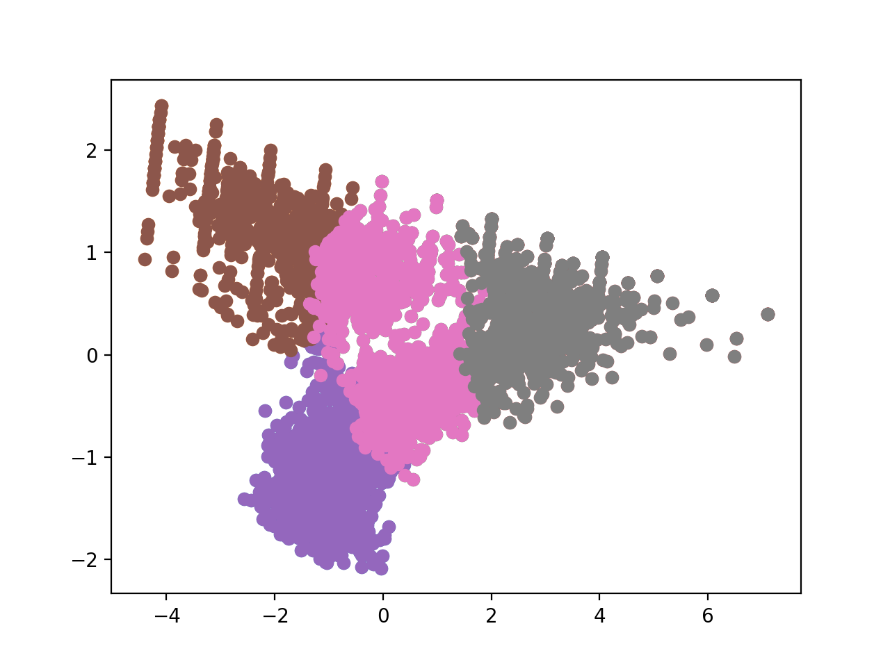

# 顧客の行動を予測する１０本ノック

## データの読み込み

'csv/use_log.csv' を 'uselog' に読み込め。

``` python
import pandas as pd

uselog = pd.read_csv('csv/use_log.csv')
```

'csv/customer_join.csv' を 'customer' に読み込め。

```python
customer = pd.read_csv('csv/customer_join.csv')
```

## クラスタリング

'customer' から 'mean', 'median', 'max', 'min', 'membership_period' を取り出し、KMeans によりクラス分類せよ。

``` python
from sklearn.cluster import KMeans
from sklearn.preprocessing import StandardScaler

customer_clustering = customer[
  ['mean', 'median', 'max', 'min','membership_period']
]     

sc = StandardScaler()

customer_clustering_sc = sc.fit_transform(customer_clustering)

kmeans = KMeans(n_clusters=4, random_state=0)

clusters = kmeans.fit(customer_clustering_sc)   

customer_clustering['cluster'] = clusters.labels_
```

```
           mean  median  max  min  membership_period  cluster
0      4.833333     5.0    8    2                 47        3
1      5.083333     5.0    7    3                 47        3
2      4.583333     5.0    6    3                 47        3
3      4.833333     4.5    7    2                 47        3
4      3.916667     4.0    6    1                 47        3
...         ...     ...  ...  ...                ...      ...
4187   8.000000     8.0    8    8                  1        2
4188  10.000000    10.0   10   10                  1        2
4189   8.000000     8.0    8    8                  1        2
4190  11.000000    11.0   11   11                  1        2
4191  10.000000    10.0   10   10                  1        2
```

## クラスタリング結果の分析
'customer_clustering' を 'cluster' でグループ化し、クラスタごとの件数を算出せよ。

```python
customer_clustering.groupby(by='cluster')['cluster'].count()  
```
```
cluster
0    1334
1     763
2     846
3    1249
Name: cluster, dtype: int64
```


'customer_clustering' を 'cluster' でグループ化し、各値の平均値を算出せよ。

```python
customer_clustering.groupby(by='cluster').mean()
```

```
             mean    median        max       min  membership_period
cluster                                                            
0        5.524239  5.375187   8.745877  2.687406          14.843328
1        3.054713  2.888598   4.756225  1.653997           9.263434
2        8.054608  8.039598  10.009456  6.160757           7.072104
3        4.677494  4.671337   7.232986  2.153723          36.915933
```

## 主成分分析

'customer_clustering_sc' の変数を５つから２つに削減し、クラスタごとにプロットせよ。

``` python
from sklearn.decomposition import PCA
import matplotlib.pyplot as plt

X = customer_clustering_sc
pca = PCA(n_components=2)
pca.fit(X)
x_pca = pca.transform(X)
pca_df = pd.DataFrame(x_pca)
pca_df['cluster'] = customer_clustering['cluster']

for cluster_tag in customer_clustering['cluster'].unique():
    cluster_data = pca_df[pca_df['cluster'] == cluster_tag]
    plt.scatter(cluster_data[0], cluster_data[1])

plt.pause(0.5)
```



## クラスタリング結果と傾向の把握

customer_clustering と customer を 結合せよ。
```python
customer_clustering = pd.concat([customer_clustering, customer], axis=1)  
```

クラスタ毎に、退会者の数を集計せよ。

```python
customer_clustering.groupby(
  by=['cluster', 'is_deleted'], as_index=False).count()[
    ['cluster', 'is_deleted', 'customer_id']
  ]
```
```
   cluster  is_deleted  customer_id
0        0           0          785
1        0           1          549
2        1           1          763
3        2           0          827
4        2           1           19
5        3           0         1230
6        3           1           19
```

クラスタ毎に、定期利用者と非定期利用者の数を集計せよ。

```python
customer_clustering.groupby(
  by=['cluster', 'routine_flg'], as_index=False).count()[
    ['cluster', 'routine_flg', 'customer_id']
  ]

```

```
   cluster  routine_flg  customer_id
0        0            0          228
1        0            1         1106
2        1            0          497
3        1            1          266
4        2            0           52
5        2            1          794
6        3            0            2
7        3            1         1247
```

## 利用回数の予測
'uselog' を年月毎にグループ化した時の log_id の個数を計上する 'uselog_months' を作成せよ。

```python
uselog['usedate'] = pd.to_datetime(uselog['usedate'])
uselog['usemonth'] = uselog['usedate'].dt.strftime('%Y%m')

uselog_month = uselog.groupby(
  by=['usemonth', 'customer_id'],
  as_index=False).count()[
    ['usemonth', 'customer_id','log_id']
  ]
```

'uselog_months' から、その月の利用回数とその月から６ヶ月分の利用回数を月毎にユーザー毎に計上した DataFrame を作成せよ。


```python
year_months = list(uselog_month['usemonth'].unique())
predict_data = pd.DataFrame()

for i in range(6, len(year_months)):
  half_year_log = uselog_month[uselog_month['usemonth'] == year_months[i]]
  half_year_log.rename(columns={'log_id':'count_pred'}, inplace=True)

  for j in range(1, 7):
    prev_month_log = uselog_month[uselog_month['usemonth'] == year_months[i-j]]
    prev_month_log.rename(columns={'log_id':'count_{}'.format(j-1)}, inplace=True)
    del prev_month_log['usemonth']

    half_year_log = pd.merge(half_year_log, prev_month_log, on='customer_id', how='left')

  predict_data = pd.concat([predict_data, half_year_log], ignore_index=True)

```
```
      usemonth customer_id  count_pred  count_0  count_1  count_2  count_3  count_4  count_5
0       201810    AS002855           3      7.0      3.0      5.0      5.0      5.0      4.0
1       201810    AS008805           2      2.0      5.0      7.0      8.0      NaN      NaN
2       201810    AS009373           5      6.0      6.0      7.0      4.0      4.0      3.0
3       201810    AS015233           7      9.0     11.0      5.0      7.0      7.0      NaN
4       201810    AS015315           4      7.0      3.0      6.0      3.0      3.0      6.0
...        ...         ...         ...      ...      ...      ...      ...      ...      ...
18305   201903    TS995853           8     11.0      NaN      NaN      NaN      NaN      NaN
18306   201903    TS998593           8      7.0      8.0      7.0      9.0      9.0      9.0
18307   201903    TS999079           3      2.0      6.0      9.0      6.0      6.0      4.0
18308   201903    TS999231           6      6.0      3.0      8.0      5.0      5.0      4.0
18309   201903    TS999855           4      4.0      7.0      5.0      4.0      4.0      5.0

[18310 rows x 9 columns]
```

欠損値のある 行を取り除け。

```python
predict_data = predict_data.dropna()
predict_data = predict_data.reset_index(drop=True)
```
```
      usemonth customer_id  count_pred  count_0  count_1  count_2  count_3  count_4  count_5
0       201810    AS002855           3      7.0      3.0      5.0      5.0      5.0      4.0
1       201810    AS009373           5      6.0      6.0      7.0      4.0      4.0      3.0
2       201810    AS015315           4      7.0      3.0      6.0      3.0      3.0      6.0
3       201810    AS015739           5      6.0      5.0      8.0      6.0      5.0      7.0
4       201810    AS019860           7      5.0      7.0      4.0      6.0      8.0      6.0
...        ...         ...         ...      ...      ...      ...      ...      ...      ...
15108   201903    TS995299           3      3.0      5.0      4.0      5.0      4.0      5.0
15109   201903    TS998593           8      7.0      8.0      7.0      9.0      9.0      9.0
15110   201903    TS999079           3      2.0      6.0      9.0      6.0      6.0      4.0
15111   201903    TS999231           6      6.0      3.0      8.0      5.0      5.0      4.0
15112   201903    TS999855           4      4.0      7.0      5.0      4.0      4.0      5.0

[15113 rows x 9 columns]
```

'predict_data' に 'customer' から 'start_date' を参照して追加せよ。

```python
predict_data = pd.merge(predict_data, customer[['customer_id', 'start_date']], on='customer_id', how='left')
predict_data['start_date'] = pd.to_datetime(predict_data['start_date'])
```
```
      usemonth customer_id  count_pred  count_0  count_1  count_2  count_3  count_4  count_5  start_date
0       201810    AS002855           3      7.0      3.0      5.0      5.0      5.0      4.0  2016-11-01
1       201810    AS009373           5      6.0      6.0      7.0      4.0      4.0      3.0  2015-11-01
2       201810    AS015315           4      7.0      3.0      6.0      3.0      3.0      6.0  2015-07-01
3       201810    AS015739           5      6.0      5.0      8.0      6.0      5.0      7.0  2017-06-01
4       201810    AS019860           7      5.0      7.0      4.0      6.0      8.0      6.0  2017-10-01
...        ...         ...         ...      ...      ...      ...      ...      ...      ...         ...
15108   201903    TS995299           3      3.0      5.0      4.0      5.0      4.0      5.0  2015-09-01
15109   201903    TS998593           8      7.0      8.0      7.0      9.0      9.0      9.0  2018-09-01
15110   201903    TS999079           3      2.0      6.0      9.0      6.0      6.0      4.0  2016-06-01
15111   201903    TS999231           6      6.0      3.0      8.0      5.0      5.0      4.0  2017-03-01
15112   201903    TS999855           4      4.0      7.0      5.0      4.0      4.0      5.0  2017-04-01

[15113 rows x 10 columns]
```
'predict_data' の 'usemonth' を 'target_date' として datetime で追加せよ。

``` python
predict_data['target_date'] = pd.to_datetime(predict_data['usemonth'],format='%Y%m')
```

```
      usemonth customer_id  count_pred  count_0  count_1  count_2  count_3  count_4  count_5  start_date target_date
0       201810    AS002855           3      7.0      3.0      5.0      5.0      5.0      4.0  2016-11-01  2018-10-01
1       201810    AS009373           5      6.0      6.0      7.0      4.0      4.0      3.0  2015-11-01  2018-10-01
2       201810    AS015315           4      7.0      3.0      6.0      3.0      3.0      6.0  2015-07-01  2018-10-01
3       201810    AS015739           5      6.0      5.0      8.0      6.0      5.0      7.0  2017-06-01  2018-10-01
4       201810    AS019860           7      5.0      7.0      4.0      6.0      8.0      6.0  2017-10-01  2018-10-01
...        ...         ...         ...      ...      ...      ...      ...      ...      ...         ...         ...
15108   201903    TS995299           3      3.0      5.0      4.0      5.0      4.0      5.0  2015-09-01  2019-03-01
15109   201903    TS998593           8      7.0      8.0      7.0      9.0      9.0      9.0  2018-09-01  2019-03-01
15110   201903    TS999079           3      2.0      6.0      9.0      6.0      6.0      4.0  2016-06-01  2019-03-01
15111   201903    TS999231           6      6.0      3.0      8.0      5.0      5.0      4.0  2017-03-01  2019-03-01
15112   201903    TS999855           4      4.0      7.0      5.0      4.0      4.0      5.0  2017-04-01  2019-03-01

[15113 rows x 11 columns]
```

'predict_data' の 会委員期間（月）を計算し、'period' として追加せよ。

``` python
from dateutil.relativedelta import relativedelta

predict_data['period'] = None

for i in range(len(predict_data)):
     delta = relativedelta(predict_data['target_date'][i], predict_data['start_date'][i])
     predict_data['period'][i] = delta.years * 12 + delta.months
```
```
      usemonth customer_id  count_pred  count_0  count_1  count_2  count_3  count_4  count_5 start_date target_date  period
0       201810    AS002855           3      7.0      3.0      5.0      5.0      5.0      4.0 2016-11-01  2018-10-01      23
1       201810    AS009373           5      6.0      6.0      7.0      4.0      4.0      3.0 2015-11-01  2018-10-01      35
2       201810    AS015315           4      7.0      3.0      6.0      3.0      3.0      6.0 2015-07-01  2018-10-01      39
3       201810    AS015739           5      6.0      5.0      8.0      6.0      5.0      7.0 2017-06-01  2018-10-01      16
4       201810    AS019860           7      5.0      7.0      4.0      6.0      8.0      6.0 2017-10-01  2018-10-01      12
...        ...         ...         ...      ...      ...      ...      ...      ...      ...        ...         ...     ...
15108   201903    TS995299           3      3.0      5.0      4.0      5.0      4.0      5.0 2015-09-01  2019-03-01      42
15109   201903    TS998593           8      7.0      8.0      7.0      9.0      9.0      9.0 2018-09-01  2019-03-01       6
15110   201903    TS999079           3      2.0      6.0      9.0      6.0      6.0      4.0 2016-06-01  2019-03-01      33
15111   201903    TS999231           6      6.0      3.0      8.0      5.0      5.0      4.0 2017-03-01  2019-03-01      24
15112   201903    TS999855           4      4.0      7.0      5.0      4.0      4.0      5.0 2017-04-01  2019-03-01      23
```
'predict_data' から、'start_date' が 2018年4月以前のデータを削除せよ。

``` python
predict_data = predict_data[predict_data['start_date'] >= pd.to_datetime('2018-04-01')]
```

## 線形回帰による予測

count_0 ~ 5 を説明変数 'X' とし、'count_pred' を目的変数 'y'とする学習用データを作成せよ。
``` python
X = predict_data[['count_0', 'count_1', 'count_2', 'count_3', 'count_4', 'count_5']]
y = predict_data['count_pred']
```

'X' と 'y' をそれぞれ、訓練用データとテスト用データに振り分けよ。

``` python
import sklearn.model_selection

X_train, X_test, y_train, y_test = sklearn.model_selection.train_test_split(X, y)
```
線形学習モデルで、X_train, y_train を使用して学習せよ。
``` python
from sklearn import linear_model

model = linear_model.LinearRegression()
model.fit(X_train, y_train)
```

このモデルの 訓練データでのスコアを確認せよ。
``` python
model.score(X_train, y_train)
```
```
0.6053271200343653
```

このモデルでの テストデータでのスコアを確認せよ。
``` python
model.score(X_test, y_test)
```
```
0.610089683580811
```

モデルに寄与している変数の寄与度を確認せよ。

``` python
print(model.coef_)
```

```
[0.3436491  0.17955193 0.15323447 0.20430279 0.07992961 0.0552641 ]
```

customer_x の ６ヶ月前からの利用回数が
　８回、７回、８回、６回、４回、４回
customer_y の ６ヶ月前からの利用回数が
　８回、６回、４回、３回、３回、２回
の場合の、利用回数を予測せよ。

```python
customer_x = [4, 4, 6, 8, 7, 8]
customer_y = [2, 3, 3, 4, 6, 8]

model.predict([customer_x, customer_y])
```

```
array([4.79083647, 2.56714216])
```
