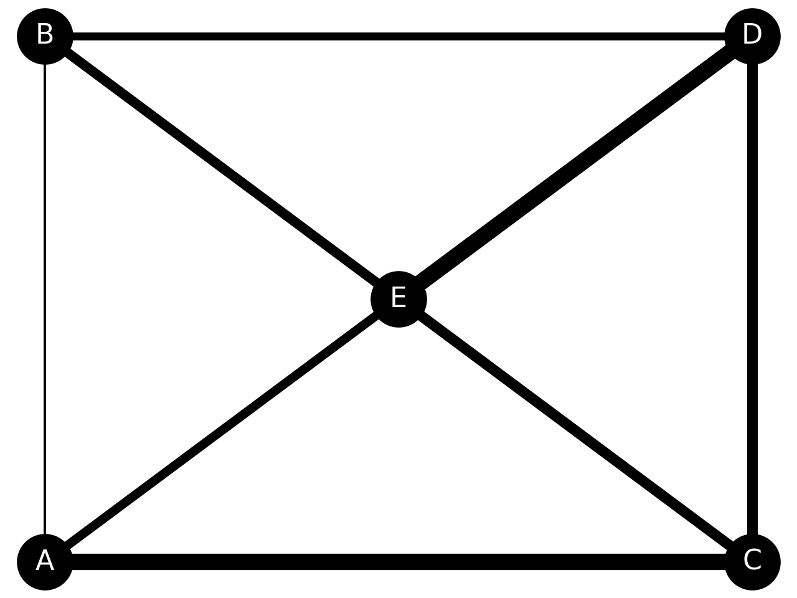

# 物流の最適ルートをコンサルティングする１０本ノック

## データの読み込み

### 'csv/tbl_factory.csv' を ０列目をインデックスに指定して ```factories``` に読み込め。

``` python
import pandas as pd

factories = pd.read_csv('csv/tbl_factory.csv', index_col=0)
```

### 'csv/warehouse.csv' を ０列目をインデックスに指定して ```warehouses``` に読み込め

``` python
warehouses = pd.read_csv('csv/tbl_warehouse.csv', index_col=0)
```

### 'csv/rel_cost.csv' を ０列目をインデックスに指定して ```cost``` に読み込め
``` python
cost = pd.read_csv('csv/rel_cost.csv', index_col=0)  
```

### 'csv/tbl_transaction.csv' を ０列目をインデックスに指定して ```trans``` に読み込め

``` python
trans = pd.read_csv('csv/tbl_transaction.csv', index_col=0)
```

## データの整形

### ```trans``` と ```cost``` を 'ToFC/FCID' と 'FromWH/WHIC' をキーにマージし、```join_data``` を作成せよ。
``` python
join_data = pd.merge(trans, cost, left_on=['ToFC', 'FromWH'], right_on=['FCID', 'WHID'], how='left')   
```

### ```join_data``` に ```factories``` を 'ToFC/FCID' をキーにマージしせよ。
``` python
join_data = pd.merge(join_data, factories, left_on='ToFC', right_on='FCID', how='left')    
```

### ```join_data``` に ```warehouses``` を 'FromWH/WHID' をキーにマージしせよ。

``` python
join_data = pd.merge(join_data, warehouses, left_on='FromWH', right_on='WHID', how='left')
```

### ```join_data``` から カラム 'TransactionDate', 'Quantity', 'Cost', 'ToFC', 'FCName', 'FCDemand', 'FromWH', 'WHSupply', 'WHRegion' を抜き出して、 ```join_data``` を上書きせよ。
``` python
join_data = join_data[['TransactionDate', 'Quantity', 'Cost', 'ToFC', 'FCName', 'FCDemand', 'FromWH', 'WHSupply', 'WHRegion']]       
```
```
TransactionDate  Quantity  Cost     ToFC FCName  FCDemand   FromWH  WHSupply WHRegion
0     2019-01-01 02:11:10        33   1.1  FC00004  横須賀工場        25  WH00003        42       関東
1     2019-01-01 06:12:42        19   1.3  FC00007   那須工場        25  WH00006        65       東北
2     2019-01-01 06:32:32        31   0.9  FC00006   山形工場        30  WH00004        60       東北
3     2019-01-01 07:17:06        18   1.6  FC00002  木更津工場        29  WH00003        42       関東
4     2019-01-01 07:52:18        30   0.8  FC00001   東京工場        28  WH00002        41       関東
...                   ...       ...   ...      ...    ...       ...      ...       ...      ...
3995  2019-12-31 11:27:51        29   1.3  FC00007   那須工場        25  WH00006        65       東北
3996  2019-12-31 17:10:21        35   1.6  FC00002  木更津工場        29  WH00003        42       関東
3997  2019-12-31 19:35:07        36   1.2  FC00003   多摩工場        31  WH00001        35       関東
3998  2019-12-31 21:45:07        34   0.3  FC00005   仙台工場        21  WH00005        72       東北
3999  2019-12-31 23:19:37        16   0.3  FC00005   仙台工場        21  WH00005        72       東北

[4000 rows x 9 columns]
```

### ``` join_data ``` から 'WHRegion' が'関東'なデータを抜き出し、```kanto``` を作成せよ。

``` python
kanto = join_data[join_data['WHRegion'] == '関東']
```

### ``` join_data ``` から 'WHRegion' が '東北'なデータを抜き出し、```tohoku``` を作成せよ。
``` python
tohoku = join_data[join_data['WHRegion'] == '東北']
```

## 計算処理

### ``` kanto ``` の 'Cost' の合計を算出せよ。
``` python
kanto['Cost'].sum()
```
```
2189.3
```

### ``` tohoku ``` の 'Cost' の合計を算出せよ。
``` python
tohoku['Cost'].sum()
```
```
2062.0
```

### ``` kanto ``` の 1個あたりの輸送コストを計算せよ。
``` python
kanto['Cost'].sum() / kanto['Quantity'].sum()
```
```
0.044546860375208566
```

### ``` tohoku ``` の 1個あたりの輸送コストを計算せよ。
``` python
tohoku['Cost'].sum() / tohoku['Quantity'].sum()
```

```
0.04106424503126618
```
輸送コストは、東北支社の方が安いことがわかる。


### 'FCRegion'　ごとの平均コストを算出せよ

``` python
pd.merge(cost, factories, on='FCID', how='left').groupby(by='FCRegion')['Cost'].mean()
```
```
FCRegion
東北    1.050
関東    1.075
Name: Cost, dtype: float64
```
平均的なコストは差がないため、東北支社の方が効率的に輸送を行えていると言える。


## ルートの重み付け

``` python
import numpy as np

df_w = pd.read_csv('csv/network_weight.csv')
df_p = pd.read_csv('csv/network_pos.csv')

size = 10
edge_weights = []

for i in range(len(df_w)):
    for j in  range(len(df_w.columns)):
        edge_weights.append(df_w.iloc[i][j] * size)

G = nx.Graph()
for i in range(len(df_w.columns)):
    G.add_node(df_w.columns[i])

for i in range(len(df_w.columns)):
    for j in range(len(df_w.columns)):
        G.add_edge(df_w.columns[i], df_w.columns[j])

pos = {}
for i in range(len(df_w.columns)):
    node = df_w.columns[i]
    pos[node] = (df_p[node][0], df_p[node][1])

nx.draw(G, pos, with_labels=True, font_size=16, node_size=1000, node_color='k', font_color='w', width=edge_weights)
plt.pause(0.5)

```

